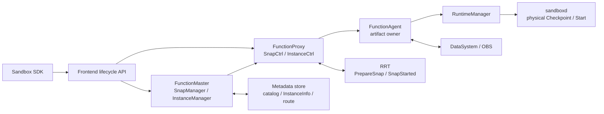
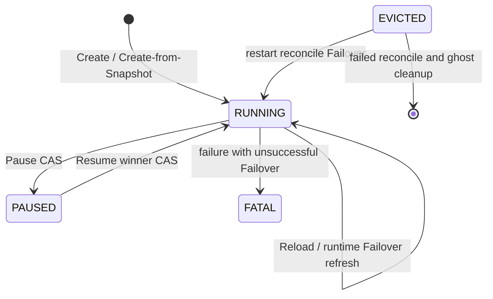
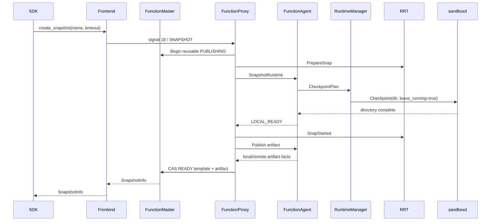
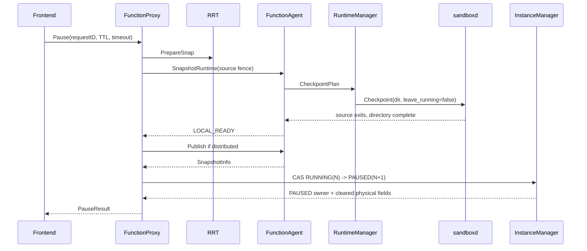

<!--
Copyright (c) Huawei Technologies Co., Ltd. 2026. All rights reserved.
Licensed under the Apache License, Version 2.0.
See the LICENSE file in this repository for the complete license text.
-->

# KEP-SANDBOX-SNAPSHOT-20260813：Sandbox 快照生命周期与本地恢复架构

| 字段 | 值 |
|---|---|
| 编号 | KEP-SANDBOX-SNAPSHOT-20260813 |
| 状态 | 已实现 |
| 作者 | openYuanRong Sandbox Snapshot contributors |
| SIG / 模块 | YuanRong / Sandbox SDK、Frontend、FunctionSystem、RRT |
| 评审人 | SDK、Frontend、FunctionMaster/Proxy、FunctionAgent、RuntimeManager 与 RRT 维护者 |
| 批准人 | openYuanRong 代码评审角色 |
| 创建日期 | 2026-08-13 |
| 最后更新 | 2026-08-31 |

## 摘要

本设计描述已落地的 Sandbox 可复用 Snapshot、Create-from-Snapshot、Pause/Resume、同节点
Failover 和 Reload。FunctionMaster 持久化租户可复用目录与 PAUSED 逻辑状态，FunctionProxy
负责 source gate、恢复调度和 version CAS，FunctionAgent 拥有 checkpoint 目录、发布、Pin 与
LRU，RuntimeManager 通过 sandboxd `Checkpoint` 和 `Start(checkpoint_info)` 管理物理
sandbox，RRT 通过 `PrepareSnap`、handoff 与 `SnapStarted` 恢复 listener。Pause/Reusable
artifact 可按模式保存在本地或发布到 DataSystem/OBS；Failover/Reload 的 local recovery
candidate 始终 node-local，缺失时明确失败，不执行 cold-start fallback。

## 背景与动机

“快照”覆盖了三种不同权威与寿命的对象：可复用模板、PAUSED 实例的恢复点和 RUNNING 实例的
local recovery candidate。如果把它们都看作一个可任意移动的 checkpoint 文件，会产生以下
错误：

- local artifact 被调度到其他节点，目标读到不存在或不受信任的目录；
- Pause 成功后仍依赖 source Proxy/runtime identity，源节点退出便无法 Resume；
- Failover 没有候选时静默冷启动，用户误以为状态已恢复；
- restore 与 LRU/删除并发，目录在 sandboxd Start 前被回收；
- 超时后后台 publication 迟到成功，调用方用新 identity 重试并留下冲突对象；
- Agent 或 RuntimeManager 重启后，把进程 cache 或裸目录误当作完整业务权威。

本架构把逻辑事实、物理事实和可重建 cache 分开，并以 request identity、source version、
artifact metadata 与 winner CAS 约束所有跨组件动作。

### 目标

- 六个用户操作都有可判定的前置条件、状态迁移、artifact owner、放置与成功边界。
- 可复用 Snapshot 与 Pause 支持 `local_only`、`distributed_cache`、`distributed_only`；
  distributed backend 为 DataSystem 或 OBS。
- PAUSED 状态可仅凭 FunctionMaster/metadata 重建，Resume 不依赖 source Proxy 继续存活。
- 同 request 重放、并发 Resume、RUNNING physical refresh 和 cleanup 都由 identity/version fence
  保护。
- sandboxd 输出作为 opaque caller-owned 目录处理，大 artifact 不进入 LiteBus payload 或完整
  内存字符串。
- RRT restore 后重新绑定目标 identity 并 rearm HTTP、tunnel 与 checkpoint listener。
- Failover/Reload 只恢复现有同节点 candidate；无候选与恢复失败可观测且不会降级为冷启动。

### 非目标

- 不提供节点磁盘或 Kubernetes pod 丢失后的 local artifact 恢复保证。
- 不支持跨节点 Failover/Reload，也不把可复用 Snapshot 自动转成 local recovery candidate。
- 不持久化 FunctionAgent 的完整 local artifact index，不从裸目录推断 tenant/source/backend。
- 不增加 sandboxd 专用 Restore、Capture 或 Finalize RPC。
- 不保证 checkpoint/restore 期间已有 HTTP、PTY、WebSocket、进程 stdin 或反向隧道透明续接。
- 不承诺固定时延、吞吐、压缩率、测试数量或硬件相关性能。
- 不允许旧组件按新全局配置重解释已有 SnapshotInfo 的 backend/sourceNodeID。

## 方案概述

### 用户操作

| 操作 | 对外入口 | 权威输入 | 核心结果 |
|---|---|---|---|
| Reusable Snapshot | SDK `create_snapshot`；Frontend `POST .../{id}/snapshots` | RUNNING source identity 与 lifecycle request ID | source 继续 RUNNING；Master catalog `PUBLISHING -> READY` |
| Create-from-Snapshot | SDK `Sandbox.create(snapshot_id)`；普通 Create 的 `snapshotId` | 同租户 READY template/artifact | 新 identity；省略/非正 CPU 或 memory 复制完整源 Resource，正值替换；正 limit 覆盖目标；Start restore |
| Pause | SDK `pause`；Frontend `POST .../{id}/pause` | RUNNING source version 与 Pause request ID | source 退出；CAS 为 PAUSED 并保留 SnapshotInfo |
| Resume | SDK `resume`；Frontend `POST .../{id}/resume` | 权威 PAUSED version/SnapshotInfo | Start restore、`SnapStarted`、CAS RUNNING winner |
| Failover | Create 的 `failover=true` | 故障 source 与最新 local recovery candidate | 同节点 RUNNING/EVICTED physical refresh |
| Reload | SDK `reload`；Frontend `POST .../{id}/reload` | 当前 RUNNING source 与最新 local recovery candidate | 显式同节点 physical refresh |

### 权威边界



| 组件 | 权威职责 | 可重建或明确不负责的内容 |
|---|---|---|
| Sandbox SDK | typed API、参数校验、单次调用 request ID 重用 | 不选择 node、backend 或 winner |
| Frontend | HTTP envelope/header、鉴权、错误映射、调用 Master/Proxy | route cache 不是 lifecycle 提交权威 |
| FunctionMaster SnapManager | tenant-scoped reusable phase/version/template/artifact | 不写节点 checkpoint 目录 |
| FunctionMaster InstanceManager | PAUSED identity、Resume 调度、winner 与删除协调 | 不维护 node LRU 或 sandboxd 状态 |
| FunctionProxy | source gate、Pause/Resume、Failover/Reload、状态 CAS | 不解析 opaque artifact 内容 |
| FunctionAgent | checkpoint root、进程 local index、publication/materialize、Pin/LRU | 不持久化 tenant catalog |
| RuntimeManager | runtime capability、sandboxd Checkpoint/Start/List/Wait、端口事实 | 不持久化 PAUSED/READY |
| RRT | runtime activity、checkpoint trigger、`PrepareSnap`/handoff/`SnapStarted` | 不选择 storage backend |
| sandboxd | 物理 sandbox 与 caller-owned checkpoint 目录 | 不决定 snapshot ID、TTL、tenant phase |

### 三类 artifact

| 类别 | 标记与逻辑权威 | 存储 | 消费者与终点 |
|---|---|---|---|
| Reusable artifact | `recoveryCandidate=false`；Master READY catalog | local / DataSystem / OBS | 多次 Create；显式 catalog delete |
| Pause artifact | `recoveryCandidate=true`；PAUSED InstanceInfo 的 SnapshotInfo | local / DataSystem / OBS | Resume/Delete/TTL finalize |
| Internal checkpoint artifact | `internalCheckpoint=true`、`recoveryCandidate=true`；Agent index + Proxy view | 始终 local | 可成为 local recovery candidate；新候选、实例删除或 finalize |

Failover/Reload 的 selector 只过滤 `localRecoveryCandidate=true`，没有独立的 internal-only
discriminator。因此 internal checkpoint 与 Pause artifact 都可能成为“最新 local recovery
candidate”。

### 风险与缓解措施

| 风险 | 缓解措施 |
|---|---|
| local artifact 跨节点读取 | SnapshotInfo 的 sourceNodeID 转 required affinity |
| publication 响应丢失 | 相同 request 重放；Publisher Stat final 并校验 metadata |
| Resume 并发创建多个 runtime | expected PAUSED version CAS 选 winner；loser exact cleanup |
| LRU 删除 restore 输入 | `PinForRestore` / `UnpinAfterRestore`；pin 期间延迟驱逐 |
| 普通 RUNNING 写替换 runtime | 只有 failover policy 或显式 `allowRunningRuntimeRefresh` 才允许 |
| Agent 重启后裸目录被误认 | 普通 Prepare 拒绝无 record 目录；权威 ID restore 仅补建最小 pin record |
| Pause source 的预期退出触发故障恢复 | lifecycle gate 同时校验 source runtime/version/owner |
| 超时触发重复逻辑操作 | SDK 在一次调用内复用 ID；uncertain 只允许同 ID reconcile |
| OBS HEAD/Copy 非原子 | Master phase/version 约束正常单 writer，final HEAD 验证 metadata |

## 详细设计

### 1. 公共 API、header 与结果

Sandbox SDK 暴露：

```python
SnapshotInfo(snapshot_id, names)
Sandbox.create(snapshot_id, **kwargs)
Sandbox.create_snapshot(name=None, timeout_seconds=300)
Sandbox.get_snapshot(snapshot_id)
Sandbox.list_snapshots(name=None, page_token=None, page_size=None)
Sandbox.delete_snapshot(snapshot_id)
Sandbox.pause(ttl_seconds=90000, timeout_seconds=300) -> PauseResult
Sandbox.resume() -> ResumeResult
Sandbox.reload() -> bool
```

Create 的 request ID 与 lifecycle request ID 是两套 contract：raw Create 使用可选
`X-Request-Id`，缺失时由 Frontend 派生并回显；Pause、Resume、Reload 与 reusable Snapshot create
要求 regex-valid `X-YR-Request-ID`，分别使用 `pause-`、`resume-`、`reload-`、`snapshot-` 前缀。
Snapshot Get/List 不要求 lifecycle header。Snapshot Delete 只要求非空 `X-YR-Request-ID`；SDK
生成 `delete-snapshot-*`，Frontend 不对 delete 应用上述四种 prefix regex。

Sandbox SDK 的 Create 明确发送 `Accept: text/event-stream`。Frontend 的 SSE state 为
`accepted -> heartbeat* -> final`：accepted 表示 stream 已建立而不是 sandbox 已创建，heartbeat
是 comment，final 才携带 `running`、`timeout` 或 `failed`。JSON bind、body size 等 pre-stream
失败仍可使用普通 HTTP error；accepted 之后的 replay/identity、调度、timeout、下游校验和业务
失败必须写入 final event。未请求 SSE 的 raw Create 以及其他非 SSE route 使用普通
`{"code","message","data"}` envelope，其中 `data` 是 base64 JSON。

SDK Pause/Resume/Reload 对 retryable transport/gateway failure 最多尝试三次，并在同一次调用中
保留 identity；reusable Snapshot create 只发一次，失败时报告 uncertain request ID。

Frontend 普通响应是 `{"code","message","data"}`，其中 `data` 是 base64 JSON。Pause 只有在
返回 snapshot ID 与 request ID 相同且 size 大于 0 时成功。Resume 只有在返回同一 instance ID、
非空 route/Proxy 与可解析端口映射时成功。route cache 的本地发布不属于 Resume success boundary。

### 2. 内部 wire 与 capability

`common.SnapType` 的当前值为：

```text
DUMPSTATE = 0
SNAPSHOT = 1
PAUSE_RESUME = 2
```

`SnapshotRuntimeRequest` 携带 request、instance、runtime、container、snapshot、source version、
TTL、timeout、candidate/return/internal 标记和预计算对象 key。snapshot bytes 不放入该消息。

sandboxd 的物理 checkpoint contract 是：

```text
CheckpointRequest {
  id
  checkpoint_dir
  timeout_seconds
  compress
  leave_running
}
CheckpointResponse {}
```

RuntimeManager 固定 `compress=false`，让 FunctionAgent 在 publication 阶段统一处理目录。恢复使用
`SandboxService.Start(StartRequest.checkpoint_info.checkpoint_dir)`，不维护第二套 Restore RPC 或
RestoreResponse。StartResponse 返回新物理 sandbox ID 与真实端口映射。

RuntimeManager 在 Checkpoint 与 Start restore 前都要求 `ListAvailableRuntimes` 已完成，并且
目标 runtime class 声明 `supports_checkpoint_restore=true`。该 gate 不能被 local hit 或 remote
materialize 绕过。

### 3. 逻辑状态机



Pause 是唯一 `RUNNING -> PAUSED` 持久化迁移。提交同时把 owner 交给 InstanceManager，清除
runtime/container/Agent/route/port 等物理字段，保留 logical identity、source generation/version
和 SnapshotInfo。

Reusable Snapshot 不改变 RUNNING identity。Failover/Reload 也不增加持久化中间状态：只有恢复
完成点可以用相同 source version 把新 runtime/container/address/PID/port 写回 RUNNING；普通
RUNNING-to-RUNNING 更新仍是 no-op。

### 4. Reusable Snapshot flow



Proxy 在开始前取得 per-instance reverse-tunnel gate：已有活动 tunnel session 时拒绝，成功 gate
期间阻止新 session。Master reusable record ID 由 tenant、source instance 与 request ID 派生，重放
只校验 `createRequestID`；当前 metadata 没有持久 request fingerprint，CAS loser 也不回读同请求
winner。raw 调用方不能把同一 request ID 用于不同 name/content。
Proxy 通过通用 `RequestSyncHelper` 等待 SnapshotRuntime；后一次同 ID synchronizer 会替换前一次，
没有 multi-waiter coalescing 或独立 physical-attempt correlation。Agent 仅在进程内按 request ID
复用完全相同的 managed request，不提供跨重启保证。

FunctionAgent Commit 后 local-only 返回 `backend=local` 和 sourceNodeID；distributed mode 把
opaque directory 编码、压缩并发布。Master 只在 artifact identity 完整时把净化后的模板从
PUBLISHING CAS 到 READY。Reusable 的 `leave_running=true` 需要 source RRT 在物理 checkpoint
后执行 `SnapStarted`；失败不能把半完成记录标成 READY。

### 5. Create-from-Snapshot

Master 只 resolve 同 tenant 的 READY 记录。目标 request：

- 保留新的 logical ID、parent、name/namespace 与普通 placement 输入；
- 复制 function、restart policy、create options、storage、args、shutdown、executor 与 failover；
- CPU/memory 省略或非正时，复制对应完整源 Resource（含已存 limit）；正 CPU/memory 创建目标
  Resource 并替换源 Resource；
- 正 CPU/memory limit 覆盖最终目标 Resource 的 limit；limit 没有独立 presence/inheritance bit，
  因此省略或 0 不能单独要求继承、清除或压制模板 limit；
- 清除 source `portForward` 和全部物理 identity；
- 把可信 restore metadata 放入内部 schedule extension；
- local artifact 注入 sourceNodeID required affinity。

Frontend 的 replay digest 额外保存 `snapshotCPUProvided` 和 `snapshotMemoryProvided`，不保存
cpu/memory limit presence。limit 省略与显式 0 没有独立 presence 区别；正 limit 通过请求值本身
改变完整 request digest。

目标 Agent 验证/Pin local directory，或从 DataSystem/OBS 下载 publication file、materialize 到空
目录、Commit 并 Pin。RuntimeManager 构造 Start restore。一次 Create 不改变 reusable READY phase，
因此 Snapshot 可多次消费。

### 6. Pause flow

Pause 以 request ID 作为 snapshot ID，建立绑定 source runtime/version/Agent/owner 的 lifecycle
gate。数据面使用 `PAUSE_RESUME`、`localRecoveryCandidate=true`、`returnArtifact=false` 和
`leave_running=false`。



source 退出是预期结果，由 gate 吞掉而不进入普通 failure handler。成功路径不会向已退出 source
发送 `SnapStarted`。checkpoint/publication/commit 失败时，Pause rescue 只恢复原 source gate，
不创建另一逻辑 sandbox；只有确认权威 PAUSED 后才对外成功。

### 7. Resume、winner 与 loser

Master 从权威 PAUSED InstanceInfo 构造 target attempt。local artifact 使用 required source-node
affinity；distributed artifact 对 source node 使用 preferred affinity，可由其他节点恢复。

Agent materialize/Pin 后，RuntimeManager 执行 Start restore。FunctionProxy 创建 target control
client，调用 `SnapStarted`，再以 expected PAUSED version CAS 到 RUNNING。CAS 同批提交 target
Proxy/Agent/runtime/container/address/PID 和 StartResponse 的实际端口映射。

并发规则：

1. 同一 Resume request 可在进程内 registry 中合并；registry 只是优化，不是持久权威。
2. 不同 Resume attempt 可并发完成物理 restore，但只有 PAUSED version CAS winner 可发布。
3. winner 保留 runtime、端口和 Pin 生命周期，Frontend 返回 winner 字段。
4. loser 只停止自己的 target runtime 并释放自己的 Pin/端口，不按 logical instance 批量删除。
5. CAS 前失败时权威仍为 PAUSED，可由新 attempt 再调度。

Frontend SandboxRouter 通过 metadata watch/read-through 收敛 RUNNING route。Resume endpoint 不等待
本地 cache 发布，也不从响应临时拼装权威记录。

### 8. local recovery checkpoint、Failover 与 Reload

RRT 在 `YR_RRT_CONTROL_SOCKET_PATH/rrt.sock` 提供本地 `POST /checkpoint`。请求生成 signal 24，
只允许调用实例为自身创建 internal checkpoint candidate。FunctionProxy 设置
`internalCheckpoint=true`、`localRecoveryCandidate=true`、`leaveRunning=true`；FunctionAgent
不进入 remote publisher。endpoint 只有在 Proxy ACK、checkpoint handoff 与 `SnapStarted` 都完成
后返回 `{"status":"completed"}`。

Failover 与 Reload 共用 `TryLocalSnapshotRecovery`：

1. 相同 source 的并发触发共享 completion；不同 source 冲突。
2. 校验 owner、RUNNING/EVICTED、source runtime/version 和 FunctionAgent。Failover 要求
   `failover=true`；Reload 显式允许且不要求该 flag。
3. 从 Proxy LocalSnapshotView 选择 `createdAt` 最大的 candidate，同秒按 snapshot ID 确定排序。
4. 无 candidate、查询失败或 metadata 不完整时立即失败。
5. 停止 source，在原 Agent/node 用 candidate Start restore，创建 client 并调用 `SnapStarted`。
6. 仅最后提交点设置 `allowRunningRuntimeRefresh=true`，以 source version 更新物理字段。

Failover 失败后沿用 RUNNING failure/FATAL 或 EVICTED ghost-cleanup 规则。Reload 在候选选择前失败不
停止 source；source 停止后的后续失败没有独立持久化中间态。两者都没有 cold-start 分支。

### 9. RRT checkpoint 与 restore

RRT 的 `PrepareSnap` 在 ACK 前打开 sandboxd checkpoint handoff barrier，避免“响应后才打开”与
sandboxd capture 完成竞态。Prepare 不等待 activity counter 归零；`process.start` 启动的子进程
在退出前持续持有 activity，`process.poll` 不重复计数，避免 checkpoint caller 与 activity drain
自死锁。

handoff outcome：

- `resume`：source runtime 保持物理活动，等待 `SnapStarted` rearm listener；
- `restore`：target 丢弃从 source memory 继承的 pending checkpoint coordinator，重新绑定目标
  instance/runtime identity，再等待自己的 `SnapStarted`；
- `error`：通知 coordinator 失败，source 仍是当前权威。

`SnapStarted` rearm RRT HTTP、tunnel、checkpoint listener 并恢复 readiness。Reusable source、
Resume target 与 local recovery target 都需要该 handshake；Pause success 的 source 已退出，不走
target handshake。

### 10. checkpoint 目录所有权

```text
{checkpoint_root}/{snapshotID}/
└── opaque sandboxd artifact tree
```

目录生命周期：

1. FunctionAgent 创建安全、空的 snapshotID 目录。
2. sandboxd Checkpoint RPC 返回前是目录唯一 writer。
3. RPC 成功后 Agent 递归验证并 Commit 到进程内 `LocalSnapshotDescriptor`。
4. publication、materialize、Pin、LRU 与 cleanup 均由 Agent 管理。

Agent 不假设 `checkpoint.img` 或 Firecracker 私有文件名，只接受普通目录和 regular file，拒绝
符号链接、device、socket、绝对/父目录路径。size 是 regular file 总字节数，不是目录 digest。

LocalSnapshotDescriptor 不落盘，保存 snapshot/source/recovery/storage/size/createdAt 等最小事实。
Prepare 遇到“目录存在但无 committed record”时拒绝接管。显式 Pause/Reusable restore 携带权威
snapshot ID，可验证安全非空目录并补建只含 ID/size 的最小 pin record；process-local candidate 不能以此
恢复完整发现状态。

### 11. storage mode、Pin 与 LRU

| 模式 | publication | 本地生命周期 | placement |
|---|---|---|---|
| `local_only` | 无 | 目录是权威 artifact | required source node |
| `distributed_cache` | DataSystem 或 OBS | 目录进入有界 LRU；Pin 阻止驱逐 | 可跨节点 |
| `distributed_only` | DataSystem 或 OBS | publication/restore Pin 结束后删除 | 可跨节点 |

`snapshot_local_cache_max_bytes` 默认 10 GiB。刚提交项和已 Pin 项不会为满足预算被删除，因此是
软上限。对 Pin 中目录的显式 evict 只设置 evict-after-unpin。

分布式 publication 把目录编码为自描述 stream，按固定 1 MiB buffer 读写，relative path 上限
4096 bytes，并使用 gzip level 1。DataSystem 从 publication file 流式创建单个 complete final
object，不再创建 temporary 与 final 两份完整 payload。OBS 使用 multipart temporary upload、
source-ETag conditional copy 和 final HEAD；HEAD/Copy 之间不是跨 writer 的原子 destination CAS。

逻辑 key：

```text
pause/v2/{tenantHash}/{instanceID}/{snapshotID}/checkpoint.img
pause/v2/{tenantHash}/{instanceID}/{snapshotID}/attempts/{attemptID}.tmp
reusable/v1/{tenantHash}/{snapshotID}/checkpoint.img
reusable/v1/{tenantHash}/{snapshotID}/attempts/{attemptID}.tmp
```

Restore 的 remote Get 先写 staging file，校验 metadata/size/SHA，再 materialize 到空目录并 Commit。
Start 前 Pin；attempt 失败或 runtime 结束后 Unpin。

### 12. placement、资源、端口与 tunnel

- local Reusable/Pause 必须回 sourceNodeID；distributed Resume 对 source 使用 preferred affinity。
- Failover/Reload 固定原 FunctionProxy、FunctionAgent 和 node。
- Create-from-Snapshot 以 CPU/memory presence/value 选择 whole-resource 行为：省略或非正值复制
  对应完整源 Resource 及其 limit，正 CPU/memory 替换源 Resource；正 limit 再覆盖目标 limit。
  limit 省略或 0 没有独立 presence 语义，不能单独控制模板 limit。
- Snapshot metadata 当前不绑定 runtimeClass/architecture；目标仍必须通过 capability gate，部署
  还需确保内核、镜像和 runtime checkpoint 兼容。
- source port mapping 不参与目标构造。StartResponse 返回 target 真实 mapping，winner 将其写入
  InstanceInfo；端口数值可以合法复用 source 数值。
- Create-from-Snapshot 会用 source template 的 create options 覆盖 target options，但当前没有独立的
  source/target tunnel-shape 校验。调用方必须确保模板与新请求具有相同 tunnel enablement 和控制端口。
- Reusable Snapshot 对活动 reverse tunnel fail closed。Pause/Resume/Reload 不承诺已有 tunnel、
  PTY、WebSocket 或 stdin 透明存活；RRT listener rearm 只恢复服务能力，不恢复外部连接承诺。

### 13. request fencing 与 CAS

核心 fence：

- SDK/Frontend：operation-specific request ID，以及普通 Create 的解码请求摘要；
- Master reusable catalog：tenant、snapshot ID、phase 与 version；
- Pause：source owner、runtime、Agent、instance version 与 snapshot identity；
- Resume：expected PAUSED version、target attempt identity 与 artifact facts；
- local recovery：source RUNNING/EVICTED、runtime/version/Agent 与 candidate identity；
- Agent：request protobuf fingerprint、expected RuntimeManager AID、local descriptor owner；
- backend：object key、size、SHA、format/version 与 postcondition Stat。

任何 result unknown 都先读取相应权威事实。进程内请求 map、Frontend route cache 和 Agent LRU
都不能替代 CAS 或 metadata，也不能被解释为所有并发调用均已 coalesce。

### 14. restart 与 reconcile

- FunctionMaster 重启从 metadata 恢复 reusable READY/PUBLISHING/DELETING 与 PAUSED InstanceInfo；
  不读取节点私有 journal。
- FunctionProxy 重启重新获取 logical InstanceInfo；Failover instance 可在 RUNNING/EVICTED
  reconcile 中保留以尝试同节点恢复，但仍需要 Agent 当前可发现 candidate。
- FunctionAgent 重启丢失 local descriptor index。process-local candidate 即使目录仍在也不可
  发现；显式 Pause/Reusable ID 可执行安全目录验证并补建最小 pin record。
- RuntimeManager/sandboxd reconcile 负责 physical sandbox List/Wait/resource/port 与 ghost cleanup，
  不能反向构造 Master catalog 或 local recovery candidate metadata。
- RRT restore 会丢弃 source pending checkpoint request，加载目标环境 identity，并在
  `SnapStarted` 后重建 listener generation。
- Kubernetes 当前 checkpoint volume 是 pod 内 `emptyDir`；pod 重建会直接丢失 local-only
  artifact、cache 和 process-local candidate。remote READY object 仍需 Master metadata 才能
  materialize。

### 15. timeout、结果未知与重试

raw HTTP Snapshot/Pause 的 `timeoutSeconds` 都默认 300、校验 `1..3600` 并换算转发；只有这两个
body 当前接收调用方逻辑 timeout。SDK Snapshot、Pause、Resume、Reload 的每个 HTTP attempt 默认
等待 `300 + 30` 秒。Snapshot/Pause 公开 `timeout_seconds`（允许 1..3600 秒），并把操作 timeout
传给 Frontend/FunctionSystem；
Resume/Reload 没有独立 timeout 参数，但每次 attempt 仍使用默认 300 秒和 30 秒 buffer。
Reusable Snapshot create 只有一次 attempt，transport/gateway failure 为 uncertain；Pause/Resume/
Reload 最多三次 attempt，并复用同一 request ID。FunctionSystem 接受 `1..3,600,000` ms，向上
取整为 sandboxd seconds；没有显式配置的内部物理计划默认 180 秒。

同一 timeout 分别形成 physical Checkpoint wait 与 publication response wait，不是共享 absolute
deadline，也不主动 cancel archive/gzip/DataSystem/OBS 后台工作。因此客户端 timeout 可能早于
final publication。Agent 保存 in-flight/local-ready/completed 结果，Publisher 对 final Stat：

- exact metadata：视为重放成功；
- final 缺失：保留原操作失败；
- Stat 本身失败：保持 result unknown；
- metadata 不同：conflict。

调用方对 uncertain 请求只能使用相同 ID reconcile。以新 ID 重试是新逻辑 attempt。

### 16. cleanup 与已知失败窗口

成功路径：

- Reusable：临时 publication 删除；local 是否保留由 mode 决定；final 保留到 catalog delete。
- Pause：source physical resource 释放；artifact 保留到 Resume/Delete/TTL finalize。
- Resume：loser 精确清理；winner 的 restore Pin 随 runtime 生命周期释放；按 mode 清理本地目录。
- Local recovery：新 candidate、实例删除或 recovery finalize 清理旧目录。

限制：

- `PAUSE_ABORTED` 删除本地 artifact 和 temporary key，但不删除可能已成功发布且响应未知的 final；
- remote delete 的部分 FILE_NOT_FOUND/DataSystem error 按 best effort 完成，可能产生 orphan；
- DataSystem direct-final 与 OBS HEAD/Copy 都不是任意外部 writer 间的全局 CAS；
- Reload source 已停止后的后续失败没有独立持久化终态；
- cleanup 失败不能通过 wildcard 删除整个 logical instance 前缀，以免删除新 generation/winner。

### 17. 安全与兼容

- `checkpoint_root` 必须是绝对路径，只由 FunctionAgent 与 RuntimeManager/sandboxd 共享；
  FunctionProxy 无目录权限。
- OBS AK/SK/token 由 Secret 注入 FunctionAgent，并按现有 decrypt path 解密；禁止出现在日志和
  明文 values 中。
- tenant hash 只用于 object key namespace，授权仍依赖 Frontend tenant/auth、Master tenant lookup、
  backend IAM/bucket policy 和网络隔离。
- archive/materialize 全程 no-follow，拒绝越界路径、重复 entry、非法类型与 source identity 变化。
- 使用新 lifecycle 时所有组件必须成组升级；旧 reader/writer 不得读取不理解的 archive、Pin 或
  Start checkpoint_info。

### 测试计划

测试以不变量和失败窗口为判据，不依赖固定 case 数或历史性能值。

- **SDK/Frontend 单元与契约**：参数边界、typed results、create 与 lifecycle header 差异、同 ID
  retry、uncertain reusable create、CPU/memory presence、whole-resource/limit 语义、错误
  status/envelope、tenant catalog。
- **FunctionSystem 单元**：Reusable phase、PAUSED 字段清理、Resume winner/loser、RUNNING refresh
  gate、candidate-only Failover/Reload、source version fence、reverse-tunnel gate、cleanup disposition。
- **Agent/storage 单元**：安全目录、非法文件类型、4096-byte path 边界、archive round trip、
  1 MiB chunk、大文件流式 digest、Pin/soft LRU、DataSystem direct-final、OBS HEAD/Copy error。
- **RuntimeManager/sandboxd 集成**：capability 初始化与拒绝、Checkpoint 五字段、
  Start(checkpoint_info)、List/Wait/resource/port reconcile、restore cleanup。
- **RRT Rust 测试**：process activity lifetime、PrepareSnap 非阻塞、Unix checkpoint endpoint 三方
  completion、restore pending request 丢弃、identity rebind 与 listener rearm。
- **端到端**：六种操作、三种 mode、两个 backend、local/distributed placement、端口更新、源
  Proxy/pod 故障、PAUSED Delete 与重复 Pause/Resume。
- **故障注入与并发**：checkpoint/publication response 丢失、迟到成功、Stat error、Agent/Master/
  RuntimeManager restart、Resume CAS loser、LRU/pin 竞争、OBS HEAD/Copy 窗口、cleanup error。
- **大 artifact**：在真实 sandboxd/Firecracker 环境采集 bytes、duration、RSS、磁盘与 backend
  object 数，但不把一次环境的数值写成通用 SLO。

## 升级与回滚策略

升级顺序：

1. 部署支持 caller-owned checkpoint directory、runtime capability 和
   `Start(checkpoint_info)` 的 sandboxd/RuntimeManager。
2. 部署 FunctionAgent 的 directory store/publisher/materializer，再部署 FunctionProxy/Master。
3. 部署 RRT checkpoint/handoff/listener rearm。
4. 最后开放 Frontend 路由与 Sandbox SDK API。

切换 storage mode 不修改已有 SnapshotInfo；记录中的 backend/sourceNodeID 永远优先于当前全局
配置。

回滚前停止新 Snapshot/Pause/Resume/Reload 请求，等待 in-flight publication、CAS attempt 与 Pin
收敛。不得删除 PAUSED/READY 仍引用的 final object。local-only artifact 应在原 Agent index 尚存
时 Resume/Delete；Agent/pod 已丢失时只能按 metadata 与目录事实执行受控运维清理。

## 生产就绪评审

- **开关与依赖**：无独立 Pause/Resume feature switch；开放条件是组件版本、checkpoint root、
  runtime capability 和 storage mode/backend 有效。
- **容量**：监控 checkpoint root、publication staging、10 GiB soft LRU、DataSystem/OBS 容量与
  orphan。大 artifact 的 gzip CPU、磁盘和网络仍是共享资源。
- **观测**：日志关联 request/snapshot/instance/runtime/source/target/backend/version；指标关注
  checkpoint 分段耗时、published bytes、in-flight、CAS loser、Pin/LRU、route read-through 和 cleanup。
- **告警**：PAUSED/PUBLISHING/DELETING 长时间不收敛、Agent restart 后 local-only 引用、backend
  auth/容量失败、ghost cleanup、checkpoint root 增长和 repeated uncertain result。
- **硬边界**：checkpoint timeout `1..3,600,000` ms；默认 cache 10 GiB（软预算）；archive path
  4096 bytes；stream buffer 1 MiB；OBS multipart part 5 MiB。
- **运维入口**：先查 Master logical facts，再查 Proxy fence，再查 Agent index/pin/backend，最后
  交叉核验 RuntimeManager/sandboxd physical facts 与 RRT listener。

## 缺点

- 生命周期横跨八个组件，排障必须同时理解 logical 与 physical authority。
- local-only 默认降低远端依赖，但把可用性绑定到 source node、pod volume 和 Agent index。
- distributed_cache 同时占用本地与远端容量；distributed_only 的重复恢复需要重新下载。
- opaque directory 与自定义 archive 增加安全校验和格式维护成本。
- Failover/Reload 没有 cold-start fallback，也没有跨节点或持久候选发现能力。

## 备选方案

- **全部 Snapshot 强制远端存储**：增加默认 backend 依赖与 publication 成本，未采用。
- **PAUSED 继续绑定 source Proxy**：源节点退出后无法恢复，未采用。
- **缺 candidate 时 cold start**：会把状态丢失伪装成恢复成功，明确拒绝。
- **扫描裸目录重建 Agent index**：缺少 tenant/source/lifecycle authority，可能接管残留 staging，
  未采用。
- **新增 sandboxd RestoreCheckpoint RPC**：现有 `Start(checkpoint_info)` 已覆盖物理恢复，避免
  平行 wire。
- **在 LiteBus 中传完整 artifact**：对大目录造成内存与消息放大，采用路径与流式文件接口。
- **用固定 sleep 等 Frontend route**：不能形成一致性证明，采用 metadata watch/read-through。

## 基础设施需求

- FunctionAgent 与 RuntimeManager/sandboxd 可写且一致的 checkpoint root。
- distributed mode 所需 DataSystem 或 OBS、凭据、容量、网络和监控。
- 能报告 checkpoint capability、支持 handoff/restore identity 的 sandboxd runtime 与 RRT。
- 可执行节点故障、response-loss、并发 CAS、backend error 和大 artifact 验收的集成环境。
