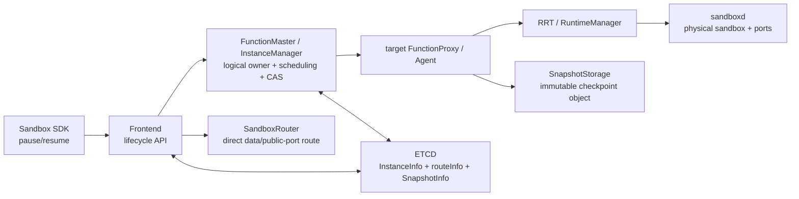
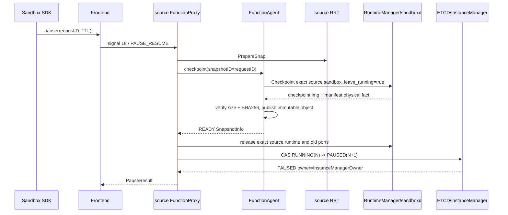

<!--
Copyright (c) Huawei Technologies Co., Ltd. 2026. All rights reserved.
Licensed under the Apache License, Version 2.0.
See the LICENSE file in this repository for the complete license text.
-->

# KEP-PR-0001：Sandbox PAUSED/Resume 控制面与 RRT 数据面（As-Built）

| 字段 | 值 |
|---|---|
| 编号 | KEP-PR-0001 |
| 状态 | WIP（单元、契约和临时镜像 standalone RRT 已通过，待最终 SHA 的 Buildkite、AKernel 镜像与 K8s 验收） |
| 作者 | openYuanRong PAUSED/Resume contributors |
| SIG / 模块 | FunctionSystem / Frontend / Sandbox Runtime |
| 评审人 | FunctionSystem、Frontend、Sandbox Runtime 维护者（待评审） |
| 批准人 | 待定 |
| 创建日期 | 2026-08-10 |
| 最后更新 | 2026-08-17 |

## 摘要

本设计为 Sandbox SDK 提供同步 `pause()`/`resume()` 生命周期，并将暂停实例从源 FunctionProxy 解耦。暂停提交后，ETCD 中的 `InstanceInfo` 与 `routeInfo` 都保留，但状态变为 `PAUSED`、控制 owner 变为 `InstanceManagerOwner`，所有源 runtime 物理身份及旧 `portForward` 被清空。FunctionMaster 根据 ETCD 中 `PAUSED + READY SnapshotInfo` 重新调度恢复目标，不依赖源 FunctionProxy 仍存活。

恢复使用 RRT（Rust Runtime）与 sandboxd checkpoint/restore 路径，不使用 Python runtime。ETCD 是逻辑状态、attempt 协调和 version CAS 的权威；sandboxd 是 sandbox 是否存在以及真实端口映射等物理事实的权威；FunctionAgent、Frontend 和 PortManager 都只是可重建缓存，不新增本地 attempt/runtime/port journal。

公共端口直接由 Frontend SandboxRouter 根据 ETCD 的 RUNNING winner 路由到目标节点，不再把 Traefik 注册作为 Resume 成功条件。Frontend 的 watch 与一次有界 ETCD read-through 提供最终收敛；Resume 响应不等待本地路由缓存发布，因此紧随其后的数据请求在极短收敛窗口内可能失败，调用方可重试。该一致性窗口不是生命周期事务的一部分。

## 背景与动机

旧生命周期把 sandbox 的控制 owner、runtime 物理身份和路由绑定到源 FunctionProxy。checkpoint 成功后若继续保留源 Proxy，源节点退出会使 Resume 无法路由；若把 `functionProxyID` 置空，FunctionMaster 又会把实例当作 scheduler 已退出并转换为 `FATAL`。旧端口映射也不能跨节点复用：逻辑 container port 不足以推导恢复 sandbox 的实际 host port。

正式架构需要同时解决：

1. 暂停状态可以仅凭 ETCD 重建，且不依赖源节点存活。
2. 恢复目标必须由 Master 重新调度，多个并发 attempt 通过 version CAS 选出唯一 winner。
3. Restore 响应丢失或 Agent 重启后，系统从 sandboxd 已持久化的物理事实收敛到同一个 sandbox 和端口映射。
4. PAUSED 控制路由必须拒绝 invoke、exec、file、port 和 tunnel 数据请求，但允许 Resume、Delete 和 Query 生命周期请求到达 Master。
5. 公共端口路由从正在淘汰的 Traefik 解耦，统一走 SandboxRouter。

## 目标

- Sandbox SDK 提供同步 Pause/Resume API，并在一次调用的重试中复用内部 request ID。
- `RUNNING(N) → PAUSED(N+1)` 原子提交 owner、清理后的物理身份、READY SnapshotInfo 和 PAUSED routeInfo。
- PAUSED 实例由 FunctionMaster/InstanceManager 接管，不绑定源 FunctionProxy。
- Resume 由 Master 选择目标 Proxy/Agent，并使用 deterministic attempt/runtime identity。
- 同一 attempt 重放得到同一个 sandbox 与真实端口映射；响应不确定时可查询 sandboxd 收敛。
- 只有 CAS winner 发布 RUNNING 物理身份、端口映射和 SandboxRouter 路由；loser 精确清理自身资源。
- Delete、失败恢复和重复 Pause/Resume 不残留 checkpoint 本地缓存、sandbox 或端口占用。

## 非目标

- 不新增 FunctionSystem、FunctionAgent、checkpoint root 或 PortManager 本地 journal。
- 不把进程内 map 当作唯一权威来源。
- 不要求恢复后的 host port 必须不同于源 host port；沿用 sandboxd 分配器，只要求映射属于恢复 sandbox 的真实物理事实。
- 不通过固定 sleep 或 SDK 内部数据请求重试建立 Resume 发布屏障。
- 不新增 Traefik Resume 路由或以 Traefik 注册完成作为生命周期成功条件。
- 不在本设计中承诺跨版本混部兼容；功能开启时相关组件必须成组升级。

## 方案概述

### 权威边界



| 事实 | 权威来源 | 可重建消费者 |
|---|---|---|
| 实例逻辑状态、owner、generation/version、winner | ETCD `InstanceInfo` | Master、Frontend、Proxy |
| PAUSED 控制路由与 RUNNING 目标路由 | ETCD `routeInfo`/`InstanceInfo` | Frontend SandboxRouter/exec cache |
| snapshot identity、READY、size、digest、TTL | ETCD `SnapshotInfo` + immutable object metadata | Master、FunctionAgent |
| sandbox 是否存在、container/host port 映射 | sandboxd 持久化 metadata 与 List/Restore 响应 | RuntimeManager、PortManager |
| watch、路由、端口分配内存索引 | 无独立权威 | Frontend、FunctionAgent、PortManager 重启后重建 |

### 核心不变量

1. 合法暂停态必须是 `PAUSED + InstanceManagerOwner + READY SnapshotInfo`。
2. PAUSED 不得保留 `runtimeID`、`runtimeAddress`、`functionAgentID`、`containerID`、`containerIP`、`unitID`、`proxyGrpcAddress` 或旧 `extensions["portForward"]`。
3. routeInfo 在 Pause 后仍存在，owner 为 `InstanceManagerOwner`，但不含可被误认为存活 runtime 的地址或身份。
4. `PAUSED + InstanceManagerOwner` 不进入 scheduler-fault/FATAL 流程。
5. Resume schedule 不携带源 runtime 身份；attempt ID 来自 Resume request ID，runtime ID 确定性派生。
6. exact sandbox 已存在时，从 sandboxd 返回真实端口映射，不重新分配或根据 container port 猜测 host port。
7. sandbox 不存在时，sandboxd 为 deterministic identity 解析/预留端口，并将 canonical mapping 与 sandbox metadata 一起持久化。
8. sandboxd 只有在 runtime、OCI spec、资源和网络事实都完成后才把物理记录从 `INTENT` 提交为 `COMMITTED`；List 不发布 intent。
9. `PAUSED(N) → RUNNING(N+1)` CAS 只有一个 winner；winner 的目标 owner、runtime/agent/container 身份和 `portForward` 同批提交。
10. loser 只能删除自己的 deterministic sandbox、端口和 attempt 内存上下文，不得影响 winner。
11. Snapshot exact cleanup 只作用于本次 immutable snapshot；不得 wildcard 删除下一轮 Pause 的对象。

## 详细设计

### 1. Sandbox SDK API 与幂等请求

公开 API：

```python
pause_result = sandbox.pause(ttl_seconds=90_000)
resume_result = sandbox.resume()
```

每次同步调用生成一个内部 `X-YR-Request-ID`，同一次 transport retry 复用该 ID。Pause 以 request ID 作为 snapshot ID；Resume 以 request ID 作为 target attempt ID。调用者不能提供任意 request ID。

`ResumeResult` 返回 winner 的：

- logical sandbox ID 和 `running` 状态；
- `function_proxy_id`、`node_id`、`route_address`；
- 从 ETCD winner `extensions["portForward"]` 派生的 `port_mappings`。

PTY 地址/TLS 解析不属于 Pause/Resume 变更，保持既有 Sandbox SDK 行为。

### 2. Pause 提交



Pause CAS 同时写入 `InstanceInfo` 与 routeInfo：

- `state = PAUSED`；
- `functionProxyID = InstanceManagerOwner`；
- 清空全部源 runtime 物理身份；
- 删除旧 `portForward`；
- 保留 logical instance ID、原 request ID、tenant、function、generation 和 READY SnapshotInfo；
- version 增加 1。

若 CAS 结果不确定，Proxy 重新读取 ETCD，并以源 version、snapshot identity、PAUSED owner 和已清空字段判断 exact commit。只有确认 PAUSED 后才报告成功。源 Proxy 在此后退出不影响恢复。

`leave_running=true` 只保证 runsc checkpoint 后源 sandbox 的物理进程仍存在；RRT 已执行 `PrepareSnap`，其 Tokio reactor、HTTP/tunnel listener 和流控状态仍需显式恢复。checkpoint、上传或 PAUSED 提交前置步骤失败时，Proxy 对同一源 RRT 发送 `SnapStarted` 并恢复本地 pause gate，然后返回原始失败。该 source rescue 不创建第二个 sandbox，也不走 Master Resume 调度，因此不是一条并行恢复 pipeline。READY 持久化成功后才释放源 runtime，随后提交 PAUSED。

### 3. PAUSED 路由和生命周期请求

Frontend 的 ETCD watch 将 PAUSED route 安装为控制路由并删除旧 exec/runtime endpoint。普通 invoke、exec、file、direct port 和 tunnel 请求返回 `instance paused`，不得回落到源 FunctionProxy。

Resume、Delete 和 Query 通过 InstanceManager/Master 路径处理。如果发起生命周期请求的 Frontend 本地没有 PAUSED cache，现有实例查询和 Master 转发仍以 ETCD 权威记录为准。

### 4. Master 调度与 deterministic identity

Master 收到 Resume 后读取 authoritative `InstanceInfo`，校验：

- 状态为 PAUSED，owner 为 `InstanceManagerOwner`；
- 源物理身份全部为空；
- request/tenant/version 有效；
- `SnapshotInfo` 为 READY，且 checkpoint ID、size、digest、storage 有效。

`BuildPauseResumeScheduleRequest` 复制逻辑实例与资源请求，但清空 proxy、agent、runtime、container、unit、address、scheduler chain 和保留的 resume extensions。Master 重新选择目标 Proxy/Agent，不向候选传递源 runtime 身份。

同一 Resume request ID 在 Master 内 coalesce；相同 ID 但不同 fingerprint 返回冲突。进程内 map 仅优化同时到达的请求，不是重启后的权威。Master 重启后根据 ETCD PAUSED 状态重新创建 attempt。

### 5. sandboxd 物理事实与端口重放

sandboxd 的 Start/Restore/List 数据契约保存并返回 concrete `protocol:hostPort:containerPort` 映射：

- `StartResponse.ports`；
- Restore RPC 复用 `StartResponse.ports`，不定义平行的 `RestoreResponse`；
- `SandboxStatus.ports`；
- sandboxd 内部持久化 metadata 的 `ports`。

正式顺序为：

```text
deterministic attempt/runtime identity
→ List/Restore 查询 exact sandbox
→ exact COMMITTED sandbox 已存在：严格匹配内部 restore identity 并返回持久化 ports
→ sandbox 不存在：解析零值 host-port 请求并为该 sandbox 预留
→ 将 canonical ports、checkpoint ID、normalized request hash 与资源事实写入 INTENT
→ Restore/runtime/spec/readiness
→ 原子提交为 COMMITTED
→ 返回同一物理 sandbox 与 ports
```

Restore 要求调用方提供 deterministic `config.sandbox_id`；空 ID 不进入正式恢复路径。同一 sandbox ID 的 `resolveDnatPorts` 重放返回已有事实，不追加分配。端口 owner 以 `(protocol, hostPort)` 为键，TCP 与 UDP 可合法复用同一数值。sandboxd 重启时以 metadata、OCI spec、runtime List、资源记录和网络事实交叉核验，只发布 COMMITTED sandbox，并据此重建 PortManager 的 owner/index/DNAT 缓存。Restore 响应丢失后，新 Agent 再次调用 List/Restore 会得到已存在 sandbox 的原始映射。

checkpoint 由 `checkpoint.img + manifest.json` 构成；manifest 持久化 checkpoint ID、源 sandbox、完整性和 `leave_running` 语义，使 Checkpoint 在 sandboxd 重启后仍可幂等重放。这是 sandboxd 拥有的物理事实，不是 FunctionSystem 节点 journal。

分配器允许物理端口恰好复用源端口，只要源端口已释放且这是 sandboxd 的正常分配结果；验收不要求端口数值变化。

### 6. RUNNING CAS、winner 与 loser

候选 Restore 和 readiness 成功后，目标响应中的端口映射进入候选 `InstanceInfo.extensions["portForward"]`，并与目标 `functionProxyID`、`proxyGrpcAddress`、runtime/agent/container 身份一起参加 `PAUSED(N) → RUNNING(N+1)` CAS。

Master 在调度成功后重新读取 ETCD winner，Resume 响应只使用 winner 字段，不从源请求、源 Proxy 或 PAUSED 的已清空映射构造结果。

并发 attempt 语义：

- CAS winner 保留目标 sandbox 和端口，发布 RUNNING route；
- CAS loser 对 deterministic identity 做 exact Stop/Delete，并释放自己的端口；
- 失败清理不得按 logical instance ID 批量删除，也不得释放 winner 端口；
- 目标在 CAS 前失败时，ETCD 仍为 PAUSED，可由新的 attempt 重新调度。

### 7. SandboxRouter 与最终一致性

公共端口不注册新的 Traefik route。SandboxRouter watch `InstanceInfo`，从 RUNNING winner 的 `proxyGrpcAddress` 和 port mapping 构造 direct route。

本地 cache miss（包括本地仍缓存 PAUSED）时，Resolver 做一次 500 ms 上限的 ETCD read-through，并对同一 instance 的并发读取合并：

- 权威 PAUSED：安装 PAUSED summary，清理 runtime route，返回 `instance paused`；
- 权威 RUNNING：校验 InstanceInfo/routeInfo version、owner、status 和地址一致，安装 winner route 后重试解析；
- 权威记录不存在：清理缓存并返回 404；
- ETCD 超时或异常：返回 unavailable，不伪装成 404。

Resume endpoint 不等待当前 Frontend 的 SandboxRouter cache/watch 完成，也不使用固定 sleep。Resume success 的边界是 ETCD RUNNING winner 已提交且响应字段有效。Frontend 不根据 Resume 响应主动拼装或改写不完整的 RUNNING summary；watch/read-through 只从 ETCD 权威记录安装完整路由。首次紧随 Resume 的数据请求通常可由 read-through 自愈；在极短传播或后端启动窗口仍可能出现瞬态失败，调用方负责重试。该选择避免把 Frontend 路由缓存可用性和等待延迟引入生命周期事务。

### 8. checkpoint 文件与清理

FunctionAgent 与 RuntimeManager/sandboxd 共享受控 checkpoint root；FunctionProxy 不挂载该目录。FunctionAgent 校验 regular file、路径边界、size 和 SHA256，再原子发布/读取 immutable snapshot object。

成功路径：

- Pause 提交后释放 source sandbox、旧端口和本地 source checkpoint reservation；
- Resume winner exact 删除已消费 snapshot object，并按 snapshot/generation fence 清理 `SnapshotInfo`；
- Restore staging/cache 在成功或失败 finalize 后删除。

失败和 Delete 路径必须处理：checkpoint builder 失败、上传失败、Restore 失败、readiness 失败、CAS loser、PAUSED 未 Resume 直接 Delete。任何路径都不得留下可归属于已结束 attempt 的 `checkpoint.img`。后端 exact Delete 失败时保留可诊断的 SnapshotInfo，而不是通过本地 journal 隐藏状态。

## 接口与兼容性

### Sandbox SDK

新增 `Sandbox.pause()`、`Sandbox.resume()`、`PauseResult`、`ResumeResult` 和 lifecycle error 映射。公开 API compatibility manifest 必须包含新增 symbol；既有 PTY 行为不变。

### Frontend

新增：

```text
POST /api/sandbox/v1/sandboxes/{sandboxID}/pause
POST /api/sandbox/v1/sandboxes/{sandboxID}/resume
```

现有数据面 endpoint 对 PAUSED 返回冲突/paused 语义。SandboxRouter direct route 与 ETCD read-through 是公共端口的正式路径。

### sandboxd wire contract

对外只保留一条 checkpoint/restore 物理契约：

- `CheckpointRequest` 只包含 `id`、`checkpoint_dir`、`checkpoint_id` 和 `leave_running`；历史占位的 `timeout`、`compress`、`trace_id` 字段号与名称必须 `reserved`。
- `CheckpointResponse` 只返回 `artifact_path`、`artifact_size` 和 `artifact_sha256`；成功与失败由 gRPC status 表达，历史 `success`、`message` 字段号与名称必须 `reserved`。
- deterministic 与 legacy local restore 共用 `Restore(RestoreRequest) returns (StartResponse)`。`checkpoint_id/expected_size/expected_sha256` 非空时执行可信恢复；三者全空时仅保留旧本地恢复语义。不得再增加 `RestoreCheckpoint` 或第二套 `RestoreResponse`。
- `RestoreRequest.checkpoint_dir` 始终是包含 `checkpoint.img` 的目录；FunctionSystem 内部可持有完整文件路径做 size/digest 校验，但调用 sandboxd 时必须传父目录，不能重复拼接文件名。
- `StartResponse.ports` 与 `SandboxStatus.ports` 是跨组件需要的真实物理事实，必须保留。
- physical phase、restore identity、resource facts 和 sandbox metadata 是 sandboxd 私有持久模型，必须位于 Go `internal` 包；公共 API 不发布创建中的 INTENT，也不暴露协调字段。

持久模型迁移保持 `meta.pb` 原字段号和 protobuf wire type，升级后必须能读取旧版本写入的 metadata。生成的 protobuf 文件必须与 `.proto` 一起提交。

### FunctionSystem 内部契约

FunctionSystem vendored sandboxd proto 必须与 sandboxd 服务端保持同一个 `Restore` 方法和响应类型，不保留 `RestoreCheckpoint` 双轨。RuntimeManager 对普通 snapshot 与 Pause 都先构造显式 `CheckpointPlan`，并始终按 runtime 注册信息选择原 executor；`ArtifactLifecycle::USER_MANAGED` 与 `INSTANCE_MANAGED` 只决定上层制品后处理，不能改变物理 executor。`SnapshotRuntimeResponse` 在 RuntimeManager→FunctionAgent 边界只传播 size、digest、result-unknown 和 Agent-local generation；不得回传节点路径、存储后端，或复用 sandboxd `SandboxState` 表示未公开的 CHECKPOINTED 协调相位。

`PAUSE_RESUME` 的节点路径规划和精确清理只属于 `PauseArtifactPathManager`，制品校验与发布由 FunctionAgent 的通用 `SnapshotArtifactPublisher` 承担。旧 `CkptFileManager` 继续服务既有 DUMPSTATE/legacy snapshot，但不得索引、引用计数或 TTL 清理 Pause/Resume 的 source/cache/attempt 目录。正常首次发布直接 conditional publish；只有冲突、重放或结果未知时才 Stat 权威后端。清理完成后还要向上剪枝空的 snapshot、instance、tenant 和业务目录，但必须保留配置的 checkpoint 根且不得删除非空祖先。

Pause/Delete 排他状态由 SnapCtrl 的单一 per-instance lifecycle phase 表达。已鉴权 Delete 只调用 `PrepareForAuthorizedDelete`，在 actor mailbox 内取消尚未产生副作用的 Prepare，或等待 checkpoint/publish/CAS 的结果未知窗口依据权威事实收敛；并发 Delete 复用同一个 preparation future。GetClient/PrepareSnap 使用有 deadline 的退避策略，不再以固定 10 ms 无限重试阻塞 Delete。

Master→Proxy 的 `RestoreSnapshotResponse` 直接复用已有 `core_service.SnapStartedInfo`，不再维护字段完全重复的 `messages.SnapstartInfo`。该响应由 ETCD winner 完整填充 `instanceID`、目标 owner、route address、node identity 和 port mappings，不能省略逻辑实例 ID 或引用 PAUSED 源字段。

## 失败与并发语义

| 场景 | 收敛结果 |
|---|---|
| Pause 响应丢失 | 相同 request ID 重放；读取 ETCD 判断 exact PAUSED commit |
| Pause 后源 Proxy 退出 | PAUSED owner 仍为 InstanceManagerOwner；Resume 由 Master 重新调度 |
| Master 重启 | 从 ETCD `PAUSED + READY SnapshotInfo` 重建，不读取节点 journal |
| Restore 成功但响应丢失 | deterministic ID 再次 List/Restore，返回 sandboxd 持久化 ports |
| Checkpoint 成功但响应丢失 | 以同一 checkpoint ID 重放 Checkpoint，读取 sandboxd 已提交 manifest；不根据 List 猜测 CHECKPOINTED |
| Agent/sandboxd 重启 | Agent 查询 sandboxd；sandboxd 交叉核验 COMMITTED metadata、runtime/spec/resource/network 后重建端口缓存 |
| 两个 Resume 并发 | version CAS 选出一个 RUNNING winner；loser exact cleanup |
| winner CAS 后 Frontend watch 滞后 | 首个请求 read-through ETCD 并安装 route；瞬态后端失败由调用方重试 |
| PAUSED 直接 Delete | 删除 READY snapshot、routeInfo、逻辑实例及残余本地/物理资源 |
| Restore 目标在 CAS 前失败 | 权威仍为 PAUSED，可重新调度 |

## 配置、升级与回滚

- 不设置全局 Pause/Resume 开关；请求是否可执行由 sandboxd capability 决定。
- FunctionAgent 获得 snapshot backend、Secret 和 checkpoint volume；FunctionProxy 不获得这些能力。
- RRT 和 sandboxd 必须使用支持 checkpoint/restore 与端口物理事实的新版本。
- 先在 standalone/x86 RRT 环境验证，再进入 K8s 单节点、跨节点和故障注入矩阵。
- 回滚前先关闭新 Pause/Resume 请求并等待 in-flight attempt 收敛；不得用旧 instance-fixed cleanup 删除新的 immutable object。

## 测试与验收

### 单元与契约测试

至少覆盖：

1. RUNNING→PAUSED owner、字段清理、routeInfo 保留和 FATAL 防护；
2. Master schedule 清空源身份，winner CAS 与并发 loser cleanup；
3. sandboxd 同 attempt 重放、响应丢失、重启后端口事实恢复；
4. sandboxd 新内部 metadata 能读取旧 `meta.pb`，INTENT 不通过 List 发布；
5. FunctionSystem Checkpoint 响应丢失以 exact replay 收敛，Pause/Resume 不进入旧 CkptFileManager；
6. Frontend PAUSED 拒绝、RUNNING/PAUSED read-through 与真实缺失 404；
7. SDK request ID 重用、结果字段、异常映射和 API manifest；
8. Helm 中 Agent/RuntimeManager checkpoint volume 与 FunctionProxy 隔离。

完整 FunctionSystem `pause_resume_unit_test` 必须检查实际选中数、通过数与 exit code；不得使用当前 GTest 1.10 不支持的 `--gtest_brief` 造成 0-test 假阳性。

### RRT standalone E2E

从 Sandbox SDK 开始验证：create → marker/file → stdin-blocked process → public HTTP port → pause → ETCD/物理资源检查 → 停止源 Proxy → Master resume → immediate file/exec/direct/public-port → snapshot/delete cleanup。

必须明确记录 RRT/Rust Runtime 启动证据，而不是 Python runtime；端口只校验映射与 sandboxd/ETCD winner 一致，不要求新旧 host port 数值不同。

进一步功能矩阵包括：单实例多轮 Pause/Resume、多个实例交叉 Pause/Resume、PAUSED 后直接 Delete、资源视图扣减/恢复、checkpoint.img 残留扫描及分段性能统计。

## 可观测性

日志应携带 logical instance、snapshot ID、attempt ID、deterministic runtime ID、source/target owner、ETCD version 和 sandboxd ID。建议指标：Pause/Resume 分段耗时、in-flight attempt、CAS winner/loser、read-through 结果、checkpoint bytes、exact cleanup 失败、sandbox/端口 orphan 数。

诊断必须从 ETCD 逻辑事实与 sandboxd 物理事实交叉验证，不依赖节点私有 journal。

## 实现边界与评审规模

FunctionSystem 特性提交以 `6a469ae8c9b11a536528334989134111e394a977` 为正确基线，当前 code-only 范围为 110 个文件、`+10,914/-871`，不包含测试文件。其中生产 `src/`/CMake/runtime-launcher 手写代码为 102 个文件、`+10,284/-570`，protobuf 生成文件为 2 个文件、`+477/-269`，proto 与部署 glue 为 6 个文件、`+153/-32`。测试保留在开发证据树中，不进入生产 squash commit。

该规模保留以下正式语义，不能按行数删除：

- FunctionMaster-owned PAUSED 状态、调度和 version CAS；
- RRT `PrepareSnap/SnapStarted` 与 source gate rescue；
- FunctionAgent-owned immutable snapshot 数据面和 exact cleanup；
- sandboxd durable manifest、`INTENT -> COMMITTED` physical record、deterministic Restore 与真实端口重放；
- winner/loser 精确清理、资源视图扣减/恢复和 Frontend PAUSED/read-through 路由。

为降低 actor 单文件复杂度，Pause、Resume、Agent snapshot 和 local pause gate 已拆到独立实现单元；deterministic identity、in-flight resume registry、snapshot storage 和 artifact path 也各自集中。进程内 registry 只合并当前进程的并发 callback，ETCD 与 sandboxd 仍分别是逻辑和物理权威。继续把 source rescue、双 snapshot backend 或 sandboxd physical phase 合并回通用 actor，会减少文件数但扩大 owner 边界并削弱故障语义，因此不采用。

## 备选方案与决策

### PAUSED 保留源 FunctionProxy

不采用。源 Proxy 生命周期将成为恢复依赖，无法满足跨节点调度和源节点退出后的恢复。

### PAUSED 清空 functionProxyID

不采用。现有 FunctionMaster 会将其解释为 scheduler 已退出并转换为 FATAL；`InstanceManagerOwner` 是显式控制 owner。

### FunctionAgent/PortManager 本地 journal

不采用。它会引入第二物理权威和额外恢复/GC 状态机；ETCD 与 sandboxd 已提供需要的逻辑和物理事实。

### Resume 等待 Frontend 本地路由发布

不采用。等待会把 Frontend cache/watch 健康纳入 Master 已提交事务的尾延迟和失败边界。采用独立 watch、ETCD read-through 与调用方瞬态重试。

### Traefik 公共端口路由

不采用。Traefik 正在淘汰；公共端口统一由 SandboxRouter 直接代理。

## 实现位置

| 能力 | 主要路径 |
|---|---|
| SDK lifecycle | `sandbox-sdk/python/yr_sandbox/` |
| Frontend lifecycle API | `frontend/pkg/frontend/api/sandbox/handler.go` |
| SandboxRouter watch/read-through | `frontend/pkg/frontend/sandboxrouter/` |
| PAUSED owner/FATAL 语义 | `functionsystem/src/function_master/instance_manager/` |
| Master Resume 调度 | `functionsystem/src/function_master/snap_manager/` |
| Pause/Resume 控制状态机 | `functionsystem/src/function_proxy/local_scheduler/snap_ctrl/` |
| Agent snapshot 数据面 | `functionsystem/src/function_agent/` |
| RuntimeManager sandboxd adapter | `functionsystem/src/runtime_manager/executor/sandboxd/` |
| sandboxd checkpoint/restore/ports | sandboxd `internal/server/`、`api/runtime/v1/` |
| K8s wiring | `deploy/k8s/charts/openyuanrong/` |

## 内收边界与非冗余契约

本轮内收按消费者和权威事实判断，不按“类型是否新增”判断：

| 内容 | 处理 | 理由 |
|---|---|---|
| sandboxd `RestoreCheckpoint`/legacy `RestoreResponse` 双轨 | 删除并统一为 `Restore` + `StartResponse` | 同一物理操作不应存在两套不兼容 RPC |
| checkpoint timeout/compress/trace 与 response success/message | 删除并 reserve | 没有实现语义；错误已有 gRPC status |
| sandboxd physical phase/identity/resource facts | 移入 `internal` 持久模型 | 仅服务节点恢复与清理，不是远程调用方事实 |
| runsc prepared-state cleanup capability | 从公共 Handler 删除并收敛到 runsc 的幂等 `Delete` | 仅 runsc 的 absent Delete 清理协调目录；Kata 等其他 Handler 不被强迫实现该语义 |
| FunctionSystem `SandboxPhysicalFact` 的 artifact/local-present 字段 | 删除；artifact path/resultUnknown 走独立字段 | CHECKPOINTED 是本地协调状态，不能伪装成 sandboxd List 状态 |
| Pause/Resume 借用 CkptFileManager | 删除 | 与 PauseArtifactManager 重复拥有 checkpoint.img 和 TTL |
| `messages.SnapstartInfo` | 删除，复用 `core_service.SnapStartedInfo` | 字段与用途完全重复 |
| Go runtime proto 中重复的 PrepareSnap/SnapStarted message 声明 | 删除第二份，保留唯一 wire 定义 | 重复符号会使后续 protobuf 生成失败 |
| FunctionAgent storage creator 子类与 FunctionProxy 启动包装器 | 删除，保留直接工厂分支并在启动函数内传播 `Status` | 单一调用点不应为测试制造生产期虚接口、静态库和二次校验 |
| Frontend Resume 后本地 RUNNING summary 改写 | 不引入 | 不完整缓存不是权威，可能先于 ETCD watch/read-through |
| DeleteCheckpoint、List ports、attempt finalize | 保留 | 分别承担 exact artifact cleanup、物理端口事实和跨进程 winner/loser 收敛 |
| SDK PauseResult/ResumeResult 与稳定 request ID | 保留 | 是公开用户契约与 unknown-outcome 幂等基础 |
| RRT PrepareSnap/SnapStarted 与 HTTP listener rearm | 保留 | 是恢复后 runtime readiness 和文件/exec 连续性的真实消费者路径 |

已知但不在本轮“冗余内收”中改动的风险：RRT 的 `checkpoint_resilient_delay` 为规避恢复后的 Tokio timer/worker stale state，当前使用 OS wall-clock 同步等待；而 `rrt-runtime` 使用 current-thread Tokio runtime，因此控制流重连 backoff 期间会暂时阻塞同一 runtime 内的数据面任务。该路径有真实恢复语义，不能作为死代码直接删除；后续应单独设计恢复后可重建的唤醒机制，再替换同步等待。

## 实施状态与后续工作

当前代码已完成单元、协议兼容、SDK 与 RRT 验证，并保留 red/green/full 证据。最终 FunctionSystem `pause_resume_unit_test` 实际选择 520 个用例，519 passed、1 个需要真实 OBS 凭据的集成项 skipped、0 failed；sandboxd Linux 全量 Go 测试 662 passed、0 failed（32 packages，7 skipped）；sandbox SDK 单元测试 68 passed、0 failed。测试均检查实际选中数与退出码，未使用不兼容 GTest 参数制造 0-test 假阳性。

RRT standalone 功能矩阵完成 28 项基础能力、单实例 5 轮 Pause/Resume 和 3 实例交叉执行；marker、文件系统、32 MiB 进程内存、stdin-blocked process、PTY、reverse tunnel 和公开 HTTP 均连续，资源视图最终恢复，`checkpoint.img` 扫描收敛为 0。standalone 样本 Pause 约 0.251 s、Resume 约 0.414 s，只描述本次单机样本，不作为容量 SLA。

北京四独立 namespace 同时验证 DataSystem 与临时 OBS 后端。OBS 覆盖同节点、源 Proxy 退出后的跨物理节点 Resume、源/双节点资源不足、失败后重试、失败后 Delete、Pause 调用方中断、5 轮循环和 3 实例交叉。最终 v3 镜像跨节点从 `192.168.10.48` 恢复到 `192.168.10.192`，Resume 约 0.615 s，响应后首次 file 2.93 ms、exec 6.57 ms，公开端口首次请求即 200；双节点最终 `sbox list`、ETCD sandbox instance/route、OBS object/multipart 均为空，`checkpoint.img=0`，只保留公共 checkpoint 根。临时 OBS bucket 已删除并以 HEAD 404 验证。

进入 ready 前需要：

1. 最终特性 SHA 的 x86 Buildkite 包构建通过；
2. 各仓 wire/API compatibility 与上游流水线复核通过；
3. 根据评审意见决定 reverse tunnel 恢复 20 秒级长尾是否作为独立性能改进；
4. PR 保持 WIP，待最终 commit/gitlink 与构建产物对应关系复核后再转 Ready。
