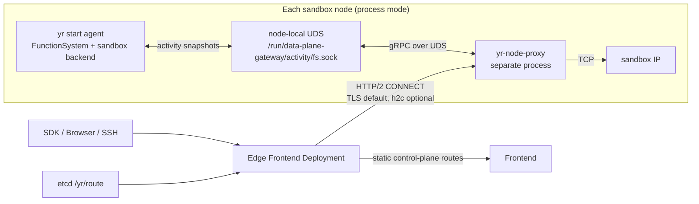

# Rust Data Plane Gateway deployment plan

## Phase 1 scope: process deployment first

The first supported deployment target is the existing process-mode installation.
The deployment contract is intentionally expressed in terms of independent
processes, environment variables, `yr start` sessions, local Unix sockets, and
host firewall rules. Kubernetes DaemonSet/Deployment manifests are a later
mapping of the same contract; they are not required for the first usable
implementation.

## 1. Deployment outcome

The process deployment keeps the Edge Frontend, Node Proxy, FunctionSystem,
and the selected sandbox backend (sandboxd or runtime-launcher) in separate
responsibility and failure domains. Sandbox is the
first route adapter; the gateway process boundary itself is workload-neutral:



Recommended process boundaries:

| Process/session | First deployment | Failure-domain rule |
|---|---|---|
| Edge Frontend | A separate `yr start --edge` process; it may be co-located with Frontend | Independently supervised; control routes proxy to Frontend while data routes bypass it |
| Node Proxy | One `yr-node-proxy` process per sandbox node, enabled from the agent session | A Gateway crash is restarted without stopping FunctionSystem or the sandbox backend |
| FunctionSystem + sandbox backend | Existing `yr start` agent session | sandboxd or runtime-launcher owns sandbox lifecycle and returns endpoint metadata; FunctionSystem publishes routes and exposes only the activity UDS |
| Legacy FunctionProxy tunnel | Existing process/session | Keep running until a later removal project |

The Node Proxy must not be added as a child process of FunctionProxy. It may
be supervised by the same `yr start` agent session because the launcher already
tracks and restarts components independently, but it has no `depends_on` edge to
FunctionProxy and no shared data-plane listener. The Edge Frontend is a separate
`yr start --edge` session so an edge restart cannot restart node-side
FunctionSystem components.

## Phase 2: Kubernetes process mapping (implemented for Buildkite smoke)

The Buildkite K8S adapter maps the same process boundaries without adding a
new top-level workload: Rust Edge is a separately supervised container in the
Frontend Pod, while Rust Node Proxy is a separate `yr start` component in
the existing node container. Co-location adds only an Edge-to-Frontend loopback
hop for the static control-plane route allow-list; data-plane HTTP/CONNECT
traffic never traverses Frontend. The Edge Frontend Service can therefore be
the single external Service. By default the legacy Frontend Service is not
rendered while Edge is enabled; Edge reaches Frontend over Pod loopback. Set
`frontend.service.exposeWhenEdgeEnabled=true` only for an explicit internal
compatibility client.
The generic chart keeps the feature disabled; the
smoke overlay enables isolated h2c and proves the complete data path.

### 2.1 Node Proxy in the existing node DaemonSet

The existing node DaemonSet already uses `hostNetwork: true`; its `yr start`
session conditionally launches Node Proxy because the process must:

- connect to sandbox IPs created on the local node;
- listen on one stable node-private port, initially `8443`;
- avoid DNAT and sandbox hostPort allocation.

Node Proxy itself does not consume extra Linux capabilities. The current
node container remains privileged for nested dockerd/runtime-launcher, which
is an existing sandbox-runtime requirement rather than a Gateway requirement.
When those processes are split into separate containers, the Gateway-specific
container should use:

```yaml
runAsNonRoot: true
runAsUser: 1002
runAsGroup: 1002
readOnlyRootFilesystem: true
allowPrivilegeEscalation: false
capabilities:
  drop: ["ALL"]
seccompProfile:
  type: RuntimeDefault
```

Reusing the node DaemonSet automatically preserves its selector, affinity and
tolerations, so FunctionSystem and Node Proxy are always scheduled together.

### 2.2 Edge-to-node reachability

`RouteInfo.nodeProxyAddress` is published as `<node-private-IP>:8443`.
Kubernetes injects the node address into FunctionSystem with:

```yaml
- name: HOST_IP
  valueFrom:
    fieldRef:
      fieldPath: status.hostIP
- name: YR_NODE_PROXY_ADDRESS
  value: "$(HOST_IP):8443"
```

In `network` mode Edge connects directly to that private address using H2/TCP.
In optional `mtls` mode it validates a separately configured TLS server name
such as `yr-node-proxy.yr.internal`, so the certificate does not need every
ephemeral node IP in its SAN list. The Rust connector separates the target
address from the TLS `server_name`.

The node port must not be publicly reachable. Enforcement is deployment-layer
and cloud-neutral:

- cloud security group/NACL: allow TCP 8443 only from Edge egress nodes;
- Cilium host policy or host nftables: apply the same restriction on each node;
- Kubernetes NetworkPolicy may supplement this, but must not be the only
  control because ordinary NetworkPolicy handling of `hostNetwork` traffic is
  CNI-dependent;
- Node Proxy additionally enforces `allowed_edge_cidrs` against the accepted
  peer address before the TLS/H2 handshake.

### 2.3 Sandbox ingress

The platform-managed sandbox policy must allow the local Node Proxy source
to the sandbox bridge CIDR and arbitrary TCP destination ports. User policy
must not be able to delete this platform rule. Host firewall policy should
deny other untrusted node processes from using the bridge CIDR directly.

### 2.4 TODO: protected sandbox egress baseline

`network` is the default Edge-to-Node mode and deliberately assumes that an
untrusted sandbox cannot reach protected internal networks. The remaining
platform TODO is to enforce that assumption before the sandbox becomes
runnable:

- deny Node, Pod, Service, sandbox bridge, VPC/peered, carrier-grade NAT,
  link-local/metadata, and corresponding IPv6 internal CIDRs;
- allow only platform-managed DNS and required runtime-control endpoint
  exceptions before evaluating the CIDR deny;
- keep the platform baseline separate from user NetworkPolicy so users can
  tighten but cannot remove it;
- update it atomically and fail sandbox startup closed when installation fails;
- disallow untrusted host-network sandboxes, which bypass the sandbox veth.

Current sandboxd traffic rules do not provide the CIDR-plus-specific-exception
precedence needed for this baseline. A follow-up must add a managed policy
layer with CIDR matching, for example an eBPF LPM trie. Until then, production
`network` mode requires an equivalent deployment-owned sandbox-veth/host
firewall policy. Node's Edge-source CIDR check remains mandatory defense in
depth.

## 3. Node-local activity UDS

Both DaemonSets mount one node hostPath:

```text
host:      <deploy_path>/run/data-plane-gateway/activity
container: <deploy_path>/run/data-plane-gateway/activity
socket:    <deploy_path>/run/data-plane-gateway/activity/fs.sock
```

FunctionSystem owns and listens on the socket; Node Proxy is only a client.
The directory must be `0770`, group-owned by the shared platform group, and
must not be mounted into user sandbox containers. A small init container may
create/chown the directory, but must not delete a live socket owned by another
Pod. FunctionSystem already unlinks its own stale `fs.sock` before binding.

Configuration on the existing node workload:

```text
YR_DATA_PLANE_NODE_PROXY_ENABLED=true
YR_NODE_PROXY_ADDRESS=$(HOST_IP):8443
YR_DATA_PLANE_NODE_PROXY_ACTIVITY_UDS_DIR=<deploy_path>/run/data-plane-gateway/activity
```

Configuration on the Node Proxy:

```text
YR_DATA_PLANE_NODE_PROXY_BIND=0.0.0.0:8443
YR_DATA_PLANE_NODE_PROXY_ADVERTISE_ADDRESS=<same address published in RouteInfo>
YR_DATA_PLANE_NODE_PROXY_HEALTH_BIND=127.0.0.1:18443
YR_DATA_PLANE_ALLOWED_TARGET_CIDRS=<actual sandbox bridge CIDRs>
YR_DATA_PLANE_ALLOWED_EDGE_CIDRS=<Edge egress CIDRs>
YR_DATA_PLANE_NODE_PROXY_ACTIVITY_UDS_DIR=<deploy_path>/run/data-plane-gateway/activity
YR_DATA_PLANE_NODE_PROXY_ACTIVITY_INTERVAL_SEC=30
YR_DATA_PLANE_EDGE_FRONTEND_NODE_SECURITY_MODE=network
```

Both target and Edge source CIDRs are required by default. The explicit
`YR_DATA_PLANE_NODE_PROXY_ALLOW_ANY_EDGE=1` escape exists only for isolated local
development.

The explicit `YR_DATA_PLANE_NODE_PROXY_ENABLED` gate isolates legacy deployments:
when it is false, Gateway activity is not an IdleActor source and the existing
idle behavior is unchanged.

## 4. TLS and credentials

There are two independent security boundaries:

- client to Edge: terminated by the Rust Edge process itself;
- Edge to Node: plaintext H2/TCP inside the mandatory network-isolation
  boundary, or optional mTLS on top of that boundary.

The Kubernetes adapter exposes a TLS listener and a plaintext listener. Direct
is accepted only on TLS and always requires a token. Tunnel and
port-forwarding/SSH default to anonymous access on either listener. Native
SSH/database clients use the local `yr-data-plane-forward` adapter.

Port-forwarding authentication is selected by the sandbox data-plane route for
the requested target port. `NONE` permits either listener without credentials;
`TOKEN` rejects the plaintext listener and requires a valid token on TLS. The
Edge parser and enforcement point are implemented first; SDK/control-plane
publication of `portForwardRoutes` is a later integration step.

Edge-to-Node is selected once with `dataPlane.edgeNode.securityMode`:

- `network` (default): plaintext H2/TCP, admitted by the configured Edge CIDRs
  and the protected sandbox-egress boundary described above;
- `mtls`: server and client certificates are mutually verified on top of the
  same network boundary.

There is no shared Edge-to-Node token or per-stream credential. In mTLS mode,
configure the existing `node_tls_*`, `tls_cert`, `tls_key`, and
`mtls_client_ca` values.

For untrusted or cross-cloud networks use mTLS plus network ACL:

- Node Proxy mounts a Kubernetes TLS Secret read-only;
- Edge mounts only the CA bundle and validates the configured server name;
- private keys never enter FunctionSystem, sandboxd, Frontend, RouteInfo, etcd,
  logs, or user sandboxes;
- certificate rotation uses overlapping CA trust, then server certificate
  rotation, then old CA removal;
- cross-cloud or untrusted-node deployments enable the implemented optional
  mTLS client CA/certificate settings without changing CONNECT metadata.

The Secret must not be embedded in ConfigMaps or image layers. The Node
Gateway readiness probe becomes false if the configured certificate/key cannot
be loaded at process start.

## 5. Health and startup ordering

The workloads intentionally do not use hard startup dependencies:

1. FunctionSystem starts its private UDS listener but rejects activity with
   `UNAVAILABLE` while Sync/Recover is running.
2. Node Proxy starts independently, serves the data plane, caches the latest
   activity batch, and retries the UDS at most once per second.
3. `LocalSchedDriver::ToReady` first marks Gateway activity unknown, then opens
   the activity service for reports.
4. Edge performs the initial `/yr/route` list and revisioned watch; its
   readiness remains false until that synchronization completes.

Probe semantics:

| Workload | Readiness | Liveness |
|---|---|---|
| Node Proxy | `/readyz` on the independent loopback health listener; false while draining | `/healthz` on the same listener |
| Edge Frontend | initial route list complete and watcher usable | process/event loop responsive |
| FunctionSystem | existing readiness only | activity UDS failure does not fail liveness/readiness |

Activity connectivity must never be part of Node Proxy readiness or
liveness. Its loss only causes FunctionSystem to pause idle reclamation.

Both Rust processes expose `/healthz`, `/readyz`, and `/metrics` on their
configured HTTP endpoints. Node uses a separate loopback health listener; Edge
serves these paths on its HTTP listener. Activity connectivity is deliberately
excluded from readiness.

### 5.1 Access, audit, and rolling service logs

Edge writes one access record for every accepted HTTP request and a second
completion record for a CONNECT byte stream. Authentication/ACL denials are
also emitted as audit records. Records include `request_id`, peer address,
TLS/plain ingress, access kind, instance ID, target port, response status,
duration, byte counters and outcome where applicable. They exclude query
strings, bearer tokens, `X-Auth`, TLS key material, and request/response bodies.

Both processes use the same bounded size-rotation settings:

```text
YR_DATA_PLANE_LOG_DIR=<writable directory>
YR_DATA_PLANE_LOG_MAX_SIZE_MB=40
YR_DATA_PLANE_LOG_MAX_FILES=10
YR_DATA_PLANE_LOG_QUEUE_CAPACITY=32768
YR_DATA_PLANE_LOG_FLUSH_INTERVAL_MS=200
YR_DATA_PLANE_LOG_STDOUT=false
YR_DATA_PLANE_EDGE_FRONTEND_ACCESS_LOG_ENABLED=true  # Edge only
```

Process mode defaults the directory to `<function-system-log>/data_plane` and
disables duplicate stdout output. Kubernetes keeps stdout enabled for the
container log collector and also writes bounded files under the existing
session/node work volume. Log rotation always uses the built-in gzip default;
it is not exposed as a deployment option. Rotation atomically detaches the current
file and a separate background thread creates `.1.gz` through `.N.gz`. Compression
failure keeps the uncompressed staging file. Rotation is independent for the
Edge service, Edge access, and Node service files. Disabling the Edge access log
drops access/audit events instead of copying them into the service log.

File logging is removed from the request path. Each tracing event is enqueued
as one complete record; one background writer per file performs size rotation
and periodic flush. The queue is bounded and non-blocking: on overflow the new
record is dropped and reported to stderr rather than applying backpressure to
HTTP/CONNECT traffic. Service shutdown drains queued records for up to five
seconds. When the dedicated Edge access sink is enabled, `yr_access` and
`yr_audit` records are not duplicated into `edge-frontend.log` or stdout.

## 6. Resource defaults

Initial requests are deliberately conservative and must be replaced with
measured values after the performance matrix:

| Workload | CPU request | Memory request | Initial replica/concurrency policy |
|---|---:|---:|---|
| Node Proxy | 100m | 128 MiB | one Pod per eligible node; FD-derived stream limit |
| Edge Frontend | 250m | 256 MiB | two replicas; HPA after traffic evidence |

Do not use a fixed 1024-stream limit. Set `RLIMIT_NOFILE`, reserve descriptors
for the runtime and listeners, then calculate stream admission from the
remaining descriptors. Pod memory limits must allow the configured H2 flow
control windows and per-stream buffers without OOM-killing all node tunnels.

The Rust Edge Frontend, Node Proxy, and forwarding helper raise the inherited
soft limit to 65,536 by default, capped by the process hard limit and without
reducing a higher value. `YR_DATA_PLANE_NOFILE_SOFT_LIMIT` overrides this
target. Node Proxy calculates its FD-derived stream budget after applying the
limit. Deployment-level `LimitNOFILE`/container runtime limits should still be
set explicitly when the hard limit is lower. Listener accept loops back off and
retry transient resource failures instead of permanently exiting.

## 7. Helm surface

Use two explicit delivery surfaces rather than letting their configurations
drift:

1. first land and validate the feature in
   `deploy/sandbox/k8s/charts/yr-k8s`, the active sandbox multi-node test chart;
2. after its AIO/multi-node gates pass, port the same values and templates to
   `deploy/k8s/charts/openyuanrong`, the standard cluster deployment chart.

Both charts add the same off-by-default values block:

```yaml
dataPlaneGateway:
  enabled: false
  node:
    image: {}
    port: 8443
    allowedTargetCidrs: []
    allowedEdgeCidrs: []
    activityHostPath: /run/openyuanrong/data-plane-gateway/activity
    tlsSecretName: ""
    resources: {}
  edge:
    image: {}
    replicas: 2
    servicePort: 8080
    routePrefix: /yr/route/business/yrk
    tlsServerName: yr-node-proxy.yr.internal
    caSecretName: ""
    resources: {}
```

Planned templates:

```text
templates/data-plane-gateway/node-daemonset.yaml
templates/data-plane-gateway/edge-deployment.yaml
templates/data-plane-gateway/edge-service.yaml
templates/data-plane-gateway/pod-disruption-budget.yaml
templates/data-plane-gateway/network-policy.yaml
```

When enabled, the existing `node-daemonset.yaml` gains only the three
FunctionSystem environment variables and the activity hostPath mount. Frontend
gains only the Edge service address/feature flag; it does not gain sandbox IP,
Node TLS key, or activity socket access.

No Helm template should be merged until the Rust binaries are produced by the
normal build/package pipeline and referenced by real multi-architecture image
artifacts. The standalone Edge binary is a complete process-mode L7/L4 serving
implementation; container images and charts remain separate delivery work.

## 8. Phase 1 process-mode deployment via `yr start`

### 8.1 Node session

The node keeps the existing agent entrypoint. The new Gateway is an optional
component in that session, not a replacement for FunctionProxy:

```text
yr start                         # existing agent mode
  ├─ function_agent
  ├─ function_proxy              # legacy path, unchanged
  ├─ runtime_launcher            # when enabled by the deployment
  └─ node_proxy        # new, explicitly enabled component
```

The `yr start` adapter registers `node_proxy` in the component
registry and enables it in both agent mode and single-node master mode from one
explicit value. It is disabled by default and enabled only when the deployment
sets the following values:

```toml
values.node_proxy.enabled = true
values.node_proxy.bind = "0.0.0.0:8443"
values.node_proxy.allowed_target_cidrs = ["<node-local sandbox CIDR>"]
values.node_proxy.allowed_edge_cidrs = ["<Edge egress CIDR>"]
values.node_proxy.activity_uds_dir = "<deploy_path>/run/data-plane-gateway/activity"
values.node_proxy.edge_security_mode = "network"
values.node_proxy.log_dir = "<function-system-log>/data_plane"
values.node_proxy.log_rolling_max_size_mb = 40
values.node_proxy.log_rolling_max_files = 10
```

For example:

```bash
yr start --block true \
  -s 'values.node_proxy.enabled=true' \
  -s 'values.node_proxy.allowed_target_cidrs=["10.88.0.0/16"]' \
  -s 'values.node_proxy.allowed_edge_cidrs=["192.0.2.0/24"]' \
  -s 'values.node_proxy.edge_security_mode="network"'
```

The rendered component environment maps these values to the
`YR_DATA_PLANE_*` variables documented above. Gateway activity is enabled in FunctionSystem with
`YR_DATA_PLANE_NODE_PROXY_ENABLED=true` and the route address is supplied through
`YR_NODE_PROXY_ADDRESS`. The Gateway component has no dependency on
FunctionProxy; it can start before the activity UDS is ready, cache its latest
snapshot locally, and reconnect in the background. A Gateway process failure is
handled by the existing component monitor as a restart of that component only.

The `yr start` launcher creates the activity UDS directory before starting the
Node Proxy. A systemd deployment can additionally use `RuntimeDirectory` to
make ownership and cleanup explicit:

```ini
[Service]
RuntimeDirectory=yr-data-plane-gateway/activity
RuntimeDirectoryMode=0770
EnvironmentFile=/etc/openyuanrong/data-plane-gateway/node.env
LimitNOFILE=262144
ExecStart=/usr/bin/yr start --block true
```

The wrapper must run the FunctionSystem agent and Gateway with a shared group
that can access `fs.sock`; it must not expose the socket to sandbox containers.
The deployment must install a host firewall rule that allows TCP 8443 only
from configured Edge CIDRs. The current process launcher does not install that
rule; it is part of the protected-network follow-up and production preflight.

### 8.2 Edge session

The Edge Frontend is not a node component and is not added to master or agent
mode. It uses the dedicated `StartMode.EDGE` and explicit command:

```text
yr start --edge --block true
  └─ edge_frontend
```

The edge mode contains no local FunctionSystem, sandboxd, FunctionProxy,
runtime launcher, or etcd process. It receives the etcd endpoint through
configuration and owns only the `/yr/route` watcher, the H2 connection pool,
and the L7/L4 frontends. Its process environment includes:

```toml
mode.edge.edge_frontend = true
values.edge_frontend.etcd_endpoints = ["https://etcd-1:2379", "https://etcd-2:2379"]
values.edge_frontend.control_plane_routes = ["exact:/healthz", "prefix:/api/sandbox"]
values.edge_frontend.node_tls_ca = "/etc/openyuanrong/data-plane-gateway/ca.crt"
values.edge_frontend.node_tls_server_name = "yr-node-proxy.yr.internal"
values.edge_frontend.log_dir = "<function-system-log>/data_plane"
values.edge_frontend.access_log_enabled = true
```

The Edge process is ready only after its initial route list succeeds. It serves
TLS ingress on `tls_bind` and anonymous tunnel/port-forwarding ingress on
`plain_bind`; all access kinds resolve through the same H2 pool. Direct is
rejected on the plaintext listener and requires a token on the TLS listener.
Production deployments route data-plane traffic directly to Edge and restrict
its client CIDRs. Edge treats `Authorization: Bearer` as canonical and accepts
the Frontend-compatible `X-Auth` form; conflicting values return `400`. Both
forms use the same optional IAM cache and RouteInfo subject authorization.
The Edge TLS listener is the unified external endpoint. Configured static
control-plane routes are forwarded to Frontend; adding a route requires only a
configuration update and Edge restart, not a Rust code change.

### 8.3 Implemented `yr start` adapter

The process adapter now provides:

1. `StartMode.EDGE` and an `--edge` flag mutually exclusive with `--master`.
2. `mode.edge` with only `edge_frontend=true`; all existing
   master/agent defaults unchanged.
3. `node_proxy` and `edge_frontend` registered with the generic
   component launcher, with value/config sections and environment
   rendering.
4. An Edge-mode dependency map with no local component dependencies; the
   Edge process waits for route-watcher readiness internally.
5. Existing session/status persistence and independent component restart. A
   failed Gateway is restarted independently by the existing monitor loop.
6. CLI/config tests proving that enabling the Gateway
   does not alter legacy components and that `--edge` never starts them.

Component-specific HTTP readiness, signal-driven drain, Node GOAWAY, route
session cancellation, and H2 connection-pool drain are implemented by the
runtime binaries.

Do not silently enable the Gateway because a binary is present. The feature
flag remains the operational switch, and a missing TLS/bridge-CIDR/UDS setting
must fail the Gateway component's own readiness rather than terminate the
FunctionSystem session.

### 8.4 Legacy process-script adapter

The existing `deploy/process/config.sh` and FunctionSystem `deploy/install.sh`
also support the same binaries for non-wheel-CLI process deployments:

```bash
bash deploy/process/deploy.sh \
  --enable_node_proxy true \
  --node_proxy_allowed_target_cidrs 10.88.0.0/16 \
  --node_proxy_allowed_edge_cidrs 192.0.2.0/24 \
  --enable_edge_frontend true \
  --edge_frontend_tls_cert /etc/yr/edge/tls.crt \
  --edge_frontend_tls_key /etc/yr/edge/tls.key \
  --edge_frontend_allowed_client_cidrs 192.0.2.0/24
```

`install.sh` resolves both executables from the wheel layout's sibling
`data_plane/bin` directory, waits on their independent readiness endpoints,
and leaves the normal process monitor responsible for isolated restart. If
Edge and Node are deliberately co-located, their listen addresses must differ.

### 8.4 Process upgrade and rollback

Upgrade node processes in this order: install the new binary and certificates,
start the optional Gateway component, verify bridge-connect and activity metrics,
then enable new Edge traffic. Roll back by switching Edge traffic to the legacy
entrypoint and stopping only the Gateway component; keep FunctionSystem and the
legacy FunctionProxy tunnel running. If the explicit gateway flag is disabled,
FunctionSystem returns to its existing idle-reclamation behavior after its
normal restart.

## 9. Build and image delivery

Deployment implementation is split into explicit gates:

1. Build `data-plane-gateway` as an independent Cargo project with locked
   dependencies through `make data-plane-gateway`; install its static Linux
   executables through the platform-specific `openyuanrong_data_plane` split
   wheel under `yr/data_plane/bin`, next to the deployed wheel tree and outside
   both `yr.runtime` and the default `make all` target.
2. Produce `yr-node-proxy`, `yr-edge-frontend`, and the optional
   `yr-data-plane-forward` client helper for both `linux/amd64` and
   `linux/arm64`.
3. Build minimal, non-root images and publish immutable digest references.
4. Generate SBOMs and vulnerability reports alongside the images.
5. Add the Helm templates and render tests only after those artifacts exist.
6. Validate one-node AIO, local multi-node, then the dedicated smoke cluster.

The Node Proxy image must contain no compiler, Docker client, sandbox rootfs,
or FunctionSystem binary.

## 10. Rollout sequence

### Stage 0: contract only

- deploy FunctionSystem and the selected sandbox backend with the additive
  endpoint/RouteInfo fields; runtime-launcher requires bridge or a custom
  container network because host/none modes have no independent endpoint;
- leave `values.node_proxy.enabled=false`;
- verify route fields and legacy traffic remain unchanged.

### Stage 1: dark Node Proxy

- deploy Node Proxy to every eligible sandbox node;
- do not route user traffic to it;
- verify source ACL, bridge reachability, UDS activity, resource metrics, and
  mTLS when that optional mode is selected;
- keep Edge selection on the legacy path.

### Stage 2: Edge shadow/canary

- deploy at least two Edge replicas and complete initial route sync;
- enable the new path for internal test tenants/instances only;
- compare errors, latency, bytes, active stream counts, and idle behavior with
  the legacy FunctionProxy tunnel.

### Stage 3: progressive traffic

- increase by tenant or instance cohort: 1%, 5%, 25%, 50%, 100%;
- hold each stage for at least one idle-timeout window and one Node rolling
  restart;
- never split one established TCP session between implementations.

### Stage 4: steady state

- keep the old FunctionProxy tunnel deployable but unused;
- remove it only through a separate compatibility/removal change.

## 11. Rolling update and drain

Node Proxy uses `RollingUpdate(maxUnavailable: 1)` and a `preStop` drain:

1. readiness false;
2. send H2 GOAWAY and reject new CONNECT streams with 503;
3. wait up to the configured drain timeout for existing streams;
4. close remaining streams when `terminationGracePeriodSeconds` expires.

There is no alternate node for an existing sandbox IP, so a Node
Gateway restart can terminate that node's live SSH/database sessions. The
rolling strategy limits the blast radius but cannot make those sessions
transparent. Edge retries only before sandbox bytes have been written.

Edge Frontend uses a PodDisruptionBudget with `minAvailable: 1`, readiness-based
service removal, GOAWAY/drain for its node pools, and at least two replicas.

## 12. Rollback

Rollback order avoids leaving FunctionSystem permanently in activity-unknown:

1. route all new traffic back to the legacy entry path;
2. drain Edge CONNECT streams;
3. set `values.node_proxy.enabled=false` on FunctionSystem nodes and
   roll them so
   legacy idle behavior is restored;
4. stop the Node Proxy DaemonSet;
5. retain additive RouteInfo/sandboxd fields until a later schema cleanup.

Do not delete the Node Proxy while leaving the explicit enable flag on:
FunctionSystem would correctly pause idle reclamation because it could no
longer prove Gateway stream counts.

## 13. Production acceptance gates

Deployment is ready for general traffic only when all of the following pass:

- every eligible sandbox node has exactly one ready Node Proxy;
- Edge initial route synchronization and compaction recovery work;
- source ACL, protected sandbox-egress, and forbidden-target tests pass; when
  mTLS is selected, certificate verification and rotation tests also pass;
- FunctionSystem startup Sync/Recover rejects early activity and accepts it
  only after `ToReady`;
- UDS loss leaves data traffic working and pauses idle reclamation;
- rolling Node/Edge upgrades exhibit bounded connection loss and successful
  drain metrics;
- activity batch size, reconnect rate, FD use, memory/stream, CPU/Gbps, and H2
  physical connection counts remain within measured budgets;
- rollback to the legacy path is rehearsed, including restoration of idle
  reclamation;
- multi-architecture images, Helm lint/template tests, AIO, multi-node smoke,
  and the direct/tunnel/port-forwarding/SSH protocol matrix pass.

## 14. Remaining packaging and live-environment gates

The Gateway process implementation is locally mock-validated. The following
delivery and security work remains before claiming a deployable production
chart:

- publish the independently built Cargo binaries into dedicated Node and Edge
  images for every supported architecture;
- provide non-root images and multi-architecture publication;
- add chart/schema/render tests and an actual sandbox bridge E2E;
- implement and validate the immutable protected-internal-CIDR sandbox-egress
  baseline described in section 2.4, including platform exceptions and
  host-network rejection;
- explicitly set ownership/mode for the shared activity directory and UDS;
  current generic `CommonGrpcServer` creates/unlinks the socket but does not
  establish this cross-Pod permission contract itself.
